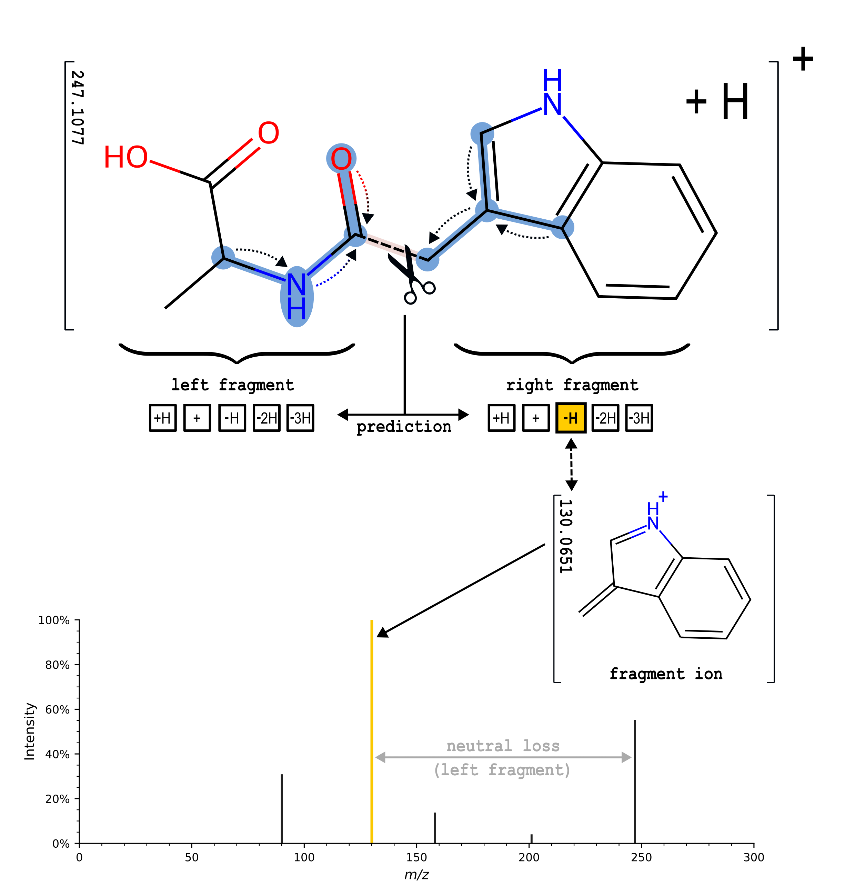

# **FIORA**

Meet FIORA! An in silico fragmentation algorithm designed to predict tandem mass spectra (MS/MS) with high accuracy. Using a graph neural network, FIORA models bond cleavages, fragment intensities, and estimates retention times (RT) and collision cross sections (CCS). Also available on our [online prediction platform](https://apps.bam.de/shn01/fioRa/).

> Nowatzky, Y., Russo, F.F., Lisec, J. et al. FIORA: Local neighborhood-based prediction of compound mass spectra from single fragmentation events. Nat Commun 16, 2298 (2025). https://doi.org/10.1038/s41467-025-57422-4

 

<figure>
  
  <figcaption>Fig. 1 | Illustration of the in silico fragmentation workflow (bottom panel) designed to simulate experimental MS/MS fragmentation (top panel).
   The figure is sourced from our publication (referenced above) and is licensed under <a href="http://creativecommons.org/licenses/by/4.0/" target="_blank">CC BY 4.0</a>.</figcaption>
</figure>

<!---
> **Disclaimer: Early Development / Prototype Notice** 
> **FIORA** is an algorithm in its early stages of development and is provided as a prototype.
Performance is not guaranteed, functionality may be incomplete, and usability was not a central concern during this phase of development. 
Users should exercise caution.
-->

## Requirements

Developed and tested with the following systems and versions:
* Debian GNU/Linux 11 (bullseye)
* Python 3.10.8
* GCC 11.2.0

## Installation

Installation guide for the FIORA Python package (under 10 minutes):

Clone the project folder 

    git clone https://github.com/BAMeScience/fiora.git

(Optional) Create a new conda environment

    conda create -n fiora python=3.10.8
    conda activate fiora

Change into the project directory (`cd fiora`). Then, install the package by using the setup.py via

    pip install .

(Optional) You may want to test that the package works as intended. This can be done by running the sripts in the *tests* directory or by using pytest (requires: `pip install pytest`)

    pytest -v tests

(Optional) Reproducible install using pinned dependencies (constraints) to match the exact packages and versions FIORA was developed with:

    pip install . -c requirements.txt

## Usage

### MS/MS prediction

Use spectral prediction function as follows:

    fiora-predict [-h] -i INPUT -o OUTPUT [--model MODEL] [--rt | --no-rt] [--ccs | --no-ccs] [--annotation | --no-annotation]

An input csv file must be provided and an output file specified (`mgf` or `msp` format).

### Input format

Input files are expected to be in csv format. With a header defining the columns: "Name", "SMILES", "Precursor_type", "CE", "Instrument_type" and rows listing individual queries.
See example [input file](examples/example_input.csv).

### Output format

Predicted spectra are provided in standard `msp` and `mgf` format.

### Example usage

Run the fiora-predict from within this directory

    fiora-predict -i examples/example_input.csv  -o examples/example_spec.mgf

By default, an open-source model is selected automatically, and predictions typically complete within a few seconds. For faster performance, specify a GPU device using the `--dev` option (e.g., `--dev cuda:0`). The output file (e.g., examples/example_spec.mgf) can be compared with the [expected results](examples/expected_output.mgf) to verify model accuracy. This verification is automatically performed by running pytest (as described above).

## The Algorithm

FIORA has been developed as a computational tool to predict bond cleavages that occur in the MS/MS fragmentation process and estimate the probabilities of resulting fragment ions. To that end, FIORA utilizes graph neural networks to learn local molecular neighborhoods around bonds, combined with edge prediction to simulate bond dissociation. The prediction determines which fragment (left or right of the bond cleavage, with up to four possible hydrogen losses) retains the charge and which becomes the neutral loss. The figure below illustrates an example fragmentation prediction for a single bond.

<figure>
  
  <figcaption>Fig. 2 | Illustration of FIORA's fragmentation algorithm.  Initially, the local neighborhood (highlighted in blue) of the designated bond is learned through multiple graph convolutions (two shown here). Based on this molecular substructure and bond features, fragment abundances are predicted. In this example, FIORA predicts the loss of two hydrogen atoms, indicating the formation of a new double bond in the right fragment. 
  The figure is sourced from our publication (referenced on top) and is licensed under <a href="http://creativecommons.org/licenses/by/4.0/" target="_blank">CC BY 4.0</a>.</figcaption>
</figure>
